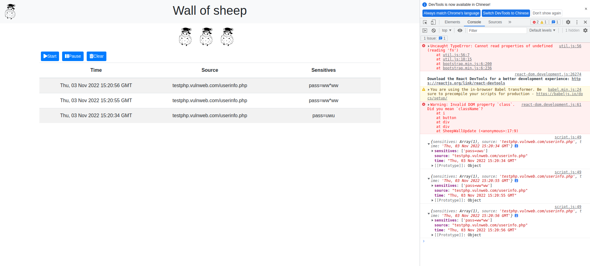

# Sheep Wall

黑客社綿羊牆 by @Mikucat @YUKI @Nesquate

## 硬體限制

不是所有 Wi-Fi USB/PCI-E 裝置都支援 AP 模式，使用之前請確認裝置是否相容。

大部份筆電內建的 Wi-Fi 晶片都可以相容，但還是以實際測試為準。

Tested: Intel AX200

## 啟動方式

需要 Linux 任一發行版 (Kernel 最好 5.10 以上) 以及 Java 11 以上

AP 相關設定請自行研究，推薦使用 NetworkManager，設定比較簡單，界面對新手也較友善

首先先把 Web Server 跑起來：

```shell
java -jar SheepWall.jar <API_PATH>
```

關於 `API_PATH` 請先到 `js/script.js` 上的第一行 (`API_URL`) 看上面寫什麼

舉例來說， `API_URL = 'http://127.0.0.1:8080/api/'` 則 `API_PATH` 要打成 `/api/`，注意前後斜線均不能忽略

若有需要請自行修改 `js/script.js` 檔案內的 `API_URL`

啟動完畢之後請先瀏覽 `API_URL` 的位置。注意 Web Server 的 Log 會顯示 `http://localhost:8080/<API_PATH>` 的位置，但因為 CORS 限制請一律以 `API_URL` 地址為主

接著啟動綿羊牆後端，權限記得加上可執行權限：

```shell
./SheepWall.kexe <NIC> <WEB_SERVER_URL>
```

`NIC` 為當 AP 的裝置名稱，請使用 `ip link` 查詢

`WEB_SERVER_URL` 為 Web Server 的 URL 網址，請務必與 `js/script.js` 當中的 `API_URL` 變數一致

出現 `A wall made by sheep!` 就成功了


## 使用方式



按下 `Start` 網頁就會開始自動更新，`Pause` 則是暫停更新，`Clear` 則是清除目前在網頁上顯示的結果

若沒有在畫面上顯示資料，請檢查 DevTools 下的 Console 訊息是否有噴錯

## 疑難排解

### 缺少 libcrypt.so

如果出現 `SheepWall.kexe: error while loading shared libraries: libcrypt.so.1: cannot open shared object file: No such file or directory`

請安裝相關套件:

Arch Linux: `sudo pacman -S libxcrypt-compat`

Ubuntu 20.04:
```shell
sudo dpkg --add-architecture i386
sudo apt update
sudo apt install libcrypt1:i386
```

## 授權

後端、WebServer 由於 @Mikucat 決定不開源，故不附上程式碼，Binaries 目前先不上傳

前端設計在取得 @YUKI 同意之前先不上傳

React.js 部份由 @Nesquate 以 MIT 授權開源釋出
